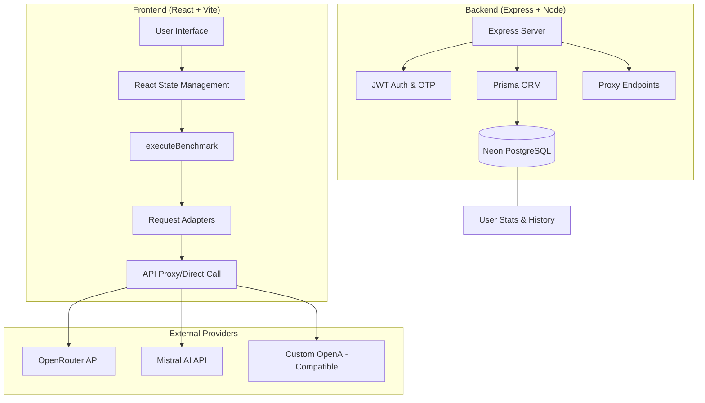

<div align="center">


# ⚡ ResponseRally — AI Benchmarking Suite

**Compare AI Models Side-by-Side: Latency, Cost, and Throughput in Real-Time.**

[](https://opensource.org/licenses/MIT)
[](https://www.typescriptlang.org/)
[](https://reactjs.org/)
[](https://expressjs.com/)
[](https://neon.tech)
[](https://www.prisma.io/)

[Key Features](#-key-features) • [Supported Models](#-supported-ai-models) • [System Architecture](#-system-architecture) • [Getting Started](#-getting-started) • [API Guide](#-api-endpoints)

</div>

---

## ✨ Key Features

ResponseRally is a benchmarking tool designed for AI researchers and developers to evaluate model performance under real-world conditions.

- 🚀 **Parallel Execution**: Submit a single prompt to N models simultaneously; no sequential waiting.
- 📊 **Metrics Performance Matrix**: Instant comparison of Latency (ms), Token Count, Throughput (tokens/s), and Cost ($).
- 🦴 **Skeleton UI**: Intelligent placeholder cards ensure a smooth UX while waiting for high-latency models.
- 🥇 **Select Winner**: Single-click "Best Response" selection to focus on quality while archiving metrics.
- 📂 **Persistent Sessions**: Full conversation history and user performance statistics saved via Neon (PostgreSQL) using Prisma ORM.
- 🔑 **Custom Providers**: Add any OpenAI-compatible API (Arxiv, DeepSeek, etc.) via your user profile.

---

## 🤖 Supported AI Models

| Model Name | Model ID | Provider | Cost Mode |
|:--- |:--- |:--- |:--- |
| **Arcee Trinity** | `arcee-ai/trinity-large-preview:free` | OpenRouter | ✅ Free |
| **StepFun 3.5** | `stepfun/step-3.5-flash:free` | OpenRouter | ✅ Free |
| **Mistral Large** | `mistralai/mistral-large-latest` | Mistral AI | 💰 Paid |
| **GLM-4.5 Air** | `z-ai/glm-4.5-air:free` | OpenRouter | ✅ Free |
| **Nemotron-3** | `nvidia/nemotron-3-nano-30b-a3b:free` | OpenRouter | ✅ Free |

---

## 🏗️ System Architecture

ResponseRally follows a modern full-stack decoupled architecture.



### 🗂️ Directory Highlights

- `Backend/`: Express backend with Prisma client for PostgreSQL data management.
- `Backend/prisma/schema.prisma`: The central source of truth for the database architecture.
- `Frontend/src/pages/Index.tsx`: The "Brain" of the application handling parallel racing.
- `Frontend/src/lib/adapters/`: Normalization layer for different AI provider responses.
- `Frontend/src/components/MetricsMatrix.tsx`: Specialized table for side-by-side data analysis.

---

## 🚀 Getting Started

### Prerequisites

- **Node.js** ≥ 18 or **Bun**
- **Neon** or any **PostgreSQL** instance
- API Keys: [OpenRouter](https://openrouter.ai) & [Mistral AI](https://console.mistral.ai)

### Quick Start

1. **Clone the Repository**
   ```bash
   git clone https://github.com/your-username/response-arena.git
   cd response-arena
   ```

2. **Backend Setup**
   ```bash
   cd Backend
   npm install
   # Ensure .env is present in /Backend
   npm run prisma:push
   npm run dev
   ```

3. **Frontend Setup**
   ```bash
   # In a new terminal
   cd Frontend
   npm install
   # Ensure .env is present in /Frontend
   npm run dev
   ```

4. **Testing**
   ```bash
   # In Backend folder
   npm run test
   # In Frontend folder
   npm run test
   ```

---

## 📊 Database Schema

ResponseRally uses a relational schema optimized for high-performance JSON operations.

### `User` Model
The core entity representing an authenticated researcher.

| Field | Type | Description |
|:--- |:--- |:--- |
| `id` | `String` (CUID) | Unique primary key. |
| `email` | `String` | Unique user email (indexed). |
| `password` | `String` | Hashed password. |
| `name` | `String` | Display name. |
| `isVerified` | `Boolean` | Email verification status. |
| `otp` | `String?` | One-time password for authentication/verification. |
| `otpExpires` | `DateTime?` | Expiration timestamp for the active OTP. |
| `totalPrompts` | `Int` | Lifetime count of prompts submitted. |
| `totalTokensUsed` | `Int` | Cumulative token usage across all providers. |
| `totalCostEstimate` | `Float` | Estimated project-wide expenditure in USD. |
| `favoriteModel` | `String?` | ID of the most frequently used or starred model. |
| `modelWins` | `Json` | Object tracking cumulative "best response" picks (e.g., `{"gpt-4": 12}`). |
| `modelMetrics` | `Json` | Deep performance stats per model (avg latency, throughput, reliability). |
| `performanceHistory` | `Json` | Time-series array for plotting performance trends. |
| `customProviders` | `Json` | Array of OpenAI-compatible configurations added by the user. |
| `recentSelections` | `Json` | Cache of recently chosen models/settings for quick access. |
| `optimizerModelId` | `String` | Selected model used for prompt engineering/optimization. |
| `optimizerProvider` | `String` | Provider associated with the optimizer model. |
| `createdAt` | `DateTime` | Account creation timestamp. |
| `updatedAt` | `DateTime` | Last profile update timestamp. |

### `Conversation` Model
Represents a multi-model benchmark session.

| Field | Type | Description |
|:--- |:--- |:--- |
| `id` | `String` (CUID) | Unique primary key. |
| `userId` | `String` | Foreign key linking to the `User`. |
| `title` | `String` | User-defined or auto-generated session title. |
| `benchmarkingMode` | `String` | The execution strategy (e.g., `full-context`, `sliding-window`). |
| `groupId` | `String?` | Identifier for model grouping/categorization. |
| `groupLabel` | `String?` | Human-readable label for the model group. |
| `slidingWindowSize` | `Int?` | Buffer size for context window optimization. |
| `messages` | `Json` | Full chat history including: roles, content, and individual message metrics. |
| `createdAt` | `DateTime` | Session initiation timestamp. |
| `updatedAt` | `DateTime` | Automatically tracked last modification time. |

---

## 🔌 API Endpoints

| Method | Endpoint | Auth | Purpose |
|:--- |:--- |:--- |:--- |
| `POST` | `/api/auth/register` | ❌ | Create account + Send OTP |
| `POST` | `/api/auth/login` | ❌ | Authenticate & get JWT |
| `GET` | `/api/conversations` | ✅ | Fetch user chat history |
| `POST` | `/api/proxy/chat` | ✅ | Unified agentic API proxy |

---

## 📜 License

Distributed under the MIT License. See `LICENSE` for more information.

---

<div align="center">
Built with ❤️ by the ResponseRally Team
</div>
