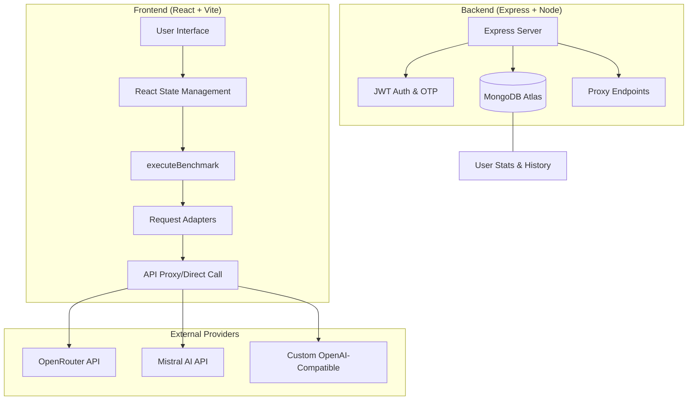

<div align="center">


# ⚡ ResponseRally — AI Benchmarking Suite

**Compare AI Models Side-by-Side: Latency, Cost, and Throughput in Real-Time.**

[](https://opensource.org/licenses/MIT)
[](https://www.typescriptlang.org/)
[](https://reactjs.org/)
[](https://expressjs.com/)
[](https://www.mongodb.com/atlas)

[Key Features](#-key-features) • [Supported Models](#-supported-ai-models) • [System Architecture](#-system-architecture) • [Getting Started](#-getting-started) • [API Guide](#-api-endpoints)

</div>

---

## ✨ Key Features

ResponseRally is a precision tool designed for AI researchers and developers to evaluate model performance under real-world conditions.

- 🚀 **Parallel Execution**: Submit a single prompt to N models simultaneously; no sequential waiting.
- 📊 **Metrics Performance Matrix**: Instant comparison of Latency (ms), Token Count, Throughput (tokens/s), and Cost ($).
- 🦴 **Skeleton UI**: Intelligent placeholder cards ensure a smooth UX while waiting for high-latency models.
- 🥇 **Select Winner**: Single-click "Best Response" selection to focus on quality while archiving metrics.
- 📂 **Persistent Sessions**: Full conversation history and user performance statistics saved via MongoDB.
- 🔑 **Custom Providers**: Add any OpenAI-compatible API (Arxiv, DeepSeek, etc.) via your user profile.

---

## 🤖 Supported AI Models

| Model Name | Model ID | Provider | Cost Mode |
|:--- |:--- |:--- |:--- |
| **Arcee Trinity** | `arcee-ai/trinity-large-preview:free` | OpenRouter | ✅ Free |
| **StepFun 3.5** | `stepfun/step-3.5-flash:free` | OpenRouter | ✅ Free |
| **Mistral Large** | `mistralai/mistral-large-latest` | Mistral AI | 💰 Paid |
| **GLM-4.5 Air** | `z-ai/glm-4.5-air:free` | OpenRouter | ✅ Free |
| **Nemotron-3** | `nvidia/nemotron-3-nano-30b-a3b:free` | OpenRouter | ✅ Free |

---

## 🏗️ System Architecture

ResponseRally follows a modern full-stack decoupled architecture.



### 🗂️ Directory Highlights

- `server/`: Express backend with Mongoose models for Users and Conversations.
- `src/pages/Index.tsx`: The "Brain" of the application handling parallel racing.
- `src/lib/adapters/`: Normalization layer for different AI provider responses.
- `src/components/MetricsMatrix.tsx`: Specialized table for side-by-side data analysis.

---

## 🚀 Getting Started

### Prerequisites

- **Node.js** ≥ 18 or **Bun**
- **MongoDB** (Local or Cloud instance)
- API Keys: [OpenRouter](https://openrouter.ai) & [Mistral AI](https://console.mistral.ai)

### Quick Start

1. **Clone & Install**
   ```bash
   git clone https://github.com/your-username/response-arena.git
   cd response-arena
   npm install
   ```

2. **Environment Configuration**
   Create a `.env` file based on `.env.example`:
   ```env
   MONGODB_URI=your_mongo_url
   JWT_SECRET=your_jwt_secret
   OPENROUTER_API_KEY=your_key
   MISTRAL_API_KEY=your_key
   EMAIL_USER=your_email
   EMAIL_PASS=your_app_password
   ```

3. **Launch**
   ```bash
   # Run both frontend and backend concurrently
   npm run dev:both
   ```

---

## 🔌 API Endpoints

| Method | Endpoint | Auth | Purpose |
|:--- |:--- |:--- |:--- |
| `POST` | `/api/auth/register` | ❌ | Create account + Send OTP |
| `POST` | `/api/auth/login` | ❌ | Authenticate & get JWT |
| `GET` | `/api/conversations` | ✅ | Fetch user chat history |
| `POST` | `/api/proxy/chat` | ✅ | Unified agentic API proxy |

---

## 📜 License

Distributed under the MIT License. See `LICENSE` for more information.

---

<div align="center">
Built with ❤️ by the ResponseRally Team
</div>
